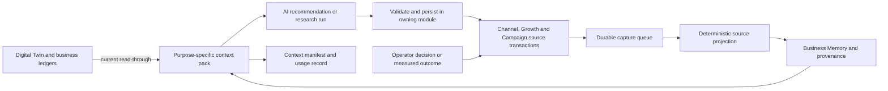

# Business Memory as shared organizational intelligence

Business Memory should become a shared, governed context service that every intelligence feature can consult and contribute to. The repository already contains much of the storage and retrieval foundation. The main missing pieces are reliable contributions from business workflows, a common context contract, source-aware freshness, and evidence that a generated result actually used that context.

This report supports [Spec 023](../../specs/023-business-memory-shared-intelligence.md), [ADR 0054](../../adrs/0054-business-memory-shared-context-and-governed-capture.md), and the [implementation plan](../superpowers/plans/2026-09-10-business-memory-shared-intelligence.md). Those documents are proposals, not implementation approval. The research baseline is repository HEAD `e8c1d6d` and read-only hosted staging inspected on 2026-09-10. No provider runs, database writes, migrations, or browser acceptance were performed for this investigation.

## 1. Product model

The common ground is a shared understanding of what the business knows, what has been suggested, what people intend to do, and what actually happened. Different AI features can use this understanding without invoking one another or sharing conversation history.

For example, Channel Audit might identify a recurring cancellation problem. A separate campaign workflow may already have recorded that an operator plans a local promotion at the affected branch. The next audit should be able to advise checking capacity before that promotion. It must preserve both source statements: the cancellation finding is measured evidence, while the promotion is a plan. The combination does not establish that the promotion caused cancellations or that addressing capacity will produce a particular saving.

Likewise, Growth Intelligence can research within the approved market scope while knowing that the organization has recently considered a particular customer segment. The resulting research claims, generated advice, acknowledgement, and planning decision become separate records. Later agents can avoid redundant advice and ask about progress. Acknowledgement means the operator saw something; planning means intent. Neither is completion or proof of effectiveness.

This is contextual learning. It is distinct from changing prompts, ranking weights, policies, or playbooks. Those behavioral changes remain governed by ADR 0013.

## 2. What exists today

| Surface | Verified repository behavior | Missing connection |
|---|---|---|
| Business Memory storage | Items, links, source/verification tiers, sensitivity, expiry, supersession, revision guards and governed writes exist | No general contribution path for intelligence outputs or operator activity |
| Memory retrieval | Lexical/vector retrieval and read-through `business_facts`; purpose vocabulary; bounded embedding failure fallback | No shared business context assembly or distinct advisory/history sections |
| Memory workspace | Search, Timeline, Lessons, Review and governed manual actions exist | Does not explain source coverage, capture lag, or which AI runs used memory |
| Campaign subject drafting | `createSubjectService().draft()` retrieves up to 12 facts/documents/notes using `onboarding_assist` | Narrow consumer; does not establish memory use in campaign generation, revisions, or learning |
| Integration ingestion | Google Business Profile record projector is wired in `src/trigger/integrations.ts` | A fixture-first provider path, not a general intelligence learning bus |
| Channel recommendations | Worker loads current findings and channel identity; prompt version 8; Google Search grounding; findings remain citations | No Business Memory input; decisions/feedback persist in channel tables only |
| Growth research | Approved branch profile, bounded topic/competitor search slots, qualification/budget/retention, extraction and support checks | Memory does not guide internal research context; no memory capture after completion |
| Growth synthesis | Loads findings, market claims, goal references and existing synthesis items | Local context assembly, not shared memory; no cross-feature history contract |
| Campaign generation | Uses claim-bound immutable source snapshot, subject and creative/reference context | General memory is not part of the pinned generation context |
| Campaign learning | Settled outcome produces a local learning proposal; operator may submit for promotion | Submission changes proposal status; it does not create or approve a Business Memory lesson |
| General event publisher | `createEventPublisher().publish()` calls the logger | There is no durable delivery or subscriber implementation behind this interface |
| Embedding maintenance | Embed/reembed/expire tasks and leased completion operations exist | No automatic dispatch/schedule wiring found outside task registrations; deployed schedules were not inspected |
| Cache | Current retrieval returns `servedFromCache: false`; optional invalidation hooks exist | ADR 0012 describes a Redis design that is not wired into this read path |

The precise code anchors are in section 10. These findings are based on call sites and persistence boundaries, not on feature names or the presence of a UI.

### Staging evidence and its limits

Read-only aggregate queries against the README development organization returned:

| Record | Count |
|---|---:|
| `memory_items` | 1,431 |
| `memory_retrieval_log` | 0 |
| `channel_recommendations` | 164 |
| `growth_intelligence_items` | 3 |
| `campaign_learning_proposals` | 0 |

Memory migrations, the campaign-learning migration, and Growth Intelligence migrations through branch-synthesis repair were present in the hosted migration history. A catalog inspection of SQL functions writing `memory_items` found the established manual/proposal/provider/embedding paths, not Channel or Growth capture functions.

These counts do not establish production use. `scripts/seed-business-memory.mjs` explicitly builds a realistic test corpus and its reset path deletes retrieval logs. Consequently, an empty retrieval log is an observability gap in this snapshot, not proof that nobody ever called memory. Row-level provenance of the whole corpus was not audited. No raw memory bodies, customer records, credentials, prompts, or provider payloads were collected.

The seed corpus is especially important for rollout: apparently verified examples must not become business evidence merely because they are present in staging. A canary must explicitly qualify its existing memory corpus or use a clean, labeled test corpus.

### Documentation drift

Spec 004 and ADRs 0011/0012 still described implementation as not started despite existing modules, routes, and hosted schema. The old memory plan has contradictory task-status statements. The current source code and staging inspection resolve the existence question; they do not justify marking the original feature fully complete. The proposal corrects status wording and lists unverified operational work instead of silently accepting stale headers.

## 3. Research findings that affect the design

### Shared memory is separate from an agent's conversation

LangChain's documentation distinguishes thread-scoped state from long-term memory shared through namespaces. It also separates semantic knowledge, episodes, and procedural behavior, and describes foreground versus background memory writes. This supports an organization-scoped service rather than direct agent-to-agent calls. It does not require adopting LangGraph in this repository.[^1]

**Design implication:** one common contract, with organization, branch, channel, purpose and visibility boundaries; source modules continue owning their own records.

### More context is not automatically better context

Anthropic treats context as a limited resource and describes selective retrieval, compaction and durable notes as ways to maintain useful information across long tasks. The relevant principle here is to preserve high-value information without loading every historical artifact.[^2]

**Design implication:** build a bounded context pack with dedicated sections for current facts, active intentions, relevant observations and reviewed lessons. Do not concatenate the entire memory corpus or run a model to rewrite the organization's biography after every event.

### Updating and abstaining need their own evaluation

LongMemEval evaluates information extraction, cross-session reasoning, temporal reasoning, knowledge updates and abstention. These categories expose why a retrieval test that only finds a matching sentence is insufficient. Its conversational benchmark is useful for choosing test categories; its accuracy figures are not performance predictions for this application.[^3]

**Design implication:** evaluate corrections, conflicting scopes, expired evidence, absent information and changes in operator intent, in addition to relevance and citation existence.

### Memory vendors demonstrate alternatives, not an automatic migration case

Mem0 describes extraction, consolidation and retrieval of salient conversational information, including a graph variant. Zep describes temporal graph integration of conversations and business data. Both publish benchmark results for their own systems. They are primary descriptions of those approaches, not independent evidence that either will outperform this repository's existing governed Postgres model.[^4][^5]

**Design implication:** borrow explicit temporal validity and selective capture. Defer a graph database or external memory vendor until real evaluation failures demonstrate a need. Existing typed source links already represent most relationships needed for the first release.

### A committed change and its memory contribution must not separate

AWS's transactional-outbox guidance explains the inconsistency caused by committing a source write and sending its notification separately. It also requires consumers to tolerate duplicate delivery.[^6]

**Design implication:** capture an identifier and bounded source revision inside the source transaction; process it asynchronously and idempotently. A logger call after a successful mutation is not a delivery mechanism. The resulting consistency guarantee is atomic capture intent plus eventual projection, not exactly-once worker execution.

### Persistent memory creates a persistent injection surface

MINJA demonstrates memory poisoning through ordinary agent interactions without direct database modification. The useful threat model is that harmful instructions can be recorded and retrieved later. Its benchmark success rates are not risk estimates for this product.[^7]

**Design implication:** source labels and citations are necessary but do not make text safe. Models cannot choose trust, scope or promotion; memory content remains data; deterministic validation must prevent retrieved instructions from changing tool authority or becoming executable configuration.

### Vector search needs both authorization and recall tests

Supabase documents the distinction between RLS-protected user access and bypass-capable roles. pgvector documents that approximate-index filtering can yield fewer results and that iterative scans can improve recall in supported versions.[^8][^9]

**Design implication:** every user read retains session RLS, privileged workers require explicit tenant/purpose checks, and tests examine tenant isolation and filtered recall separately. A SQL tenant predicate is mandatory; do not claim a shared HNSW index physically performs no work involving other tenants. Exact scoped search remains a valid small-corpus fallback.

### Grounded answers are not automatically reusable memory

The Gemini API terms, effective March 23, 2026 on the inspected page, restrict learning from and repurposing Google Search grounded results, with narrowly described storage exceptions. A channel answer's existing storage does not establish permission for a new cross-feature learning use. The Gemini documentation also explains grounding metadata and display responsibilities.[^10][^11]

**Design implication:** the new path must use non-grounded narration over internal evidence and explicitly qualified reusable research. Historical grounded output bodies are excluded from automatic memory reuse unless the provider agreement explicitly permits it. Capture safe workflow metadata and first-party findings independently; paraphrasing a grounded answer is not a rights workaround. Deployment qualification must inspect the actual provider product and agreement rather than assuming generic terms apply unchanged.

## 4. Alternatives

| Approach | Advantages | Costs and failure modes | Decision |
|---|---|---|---|
| Extend existing Postgres memory with capture and context ports | Preserves tenancy, facts, governed writes and deployment; narrow adapters connect features | Requires explicit lifecycle, replay, source rights and context provenance work | Recommended |
| Source-only read-through federation | Fresh state without duplicated narratives; smaller initial storage change | No durable cross-feature episodes, incomplete historical reconstruction, expensive repeated fan-out | Use for current authoritative state within the recommended approach |
| External memory platform / temporal graph | Rich graph operations and managed extraction can be useful at scale | Additional data processor, policy translation, provenance migration, new cost and operational dependency | Defer pending a measured relational retrieval limitation |

Appending every answer to a vector store is not a viable fourth design. It confuses suggestions with facts, repeats the same evidence as apparent corroboration, and allows obsolete advice to survive source corrections.

## 5. Recommended architecture

The loop is triggered by committed business activity, not by memory consuming its own writes. Recording a memory must never automatically run every AI feature again. Existing schedules, operator Refresh and domain change triggers control when new intelligence is generated.

Capture and truth are independent. A system can reliably record that AI made a recommendation while assigning that recommendation inference-level trust. A system can reliably record that an operator planned an action without verifying the advice itself.

## 6. Consumer-specific behavior

**Channel Audit:** keep its own current findings as mandatory evidence; add relevant campaign state, plans, constraints and memory as separately cited context. Preserve chapter coverage and the existing cap of eight items. Introduce a memory-enabled, non-grounded narration path so private context does not enter a search-enabled model. Provider-specific how-to claims require qualified sources; useful evidence-based advice remains available without them.

**Growth research:** keep every approved topic and competitor slot. Build an internal research brief using memory. Only public, already-approved profile fields and public topic aliases may become external query text; internal intentions can influence interpretation and identify unanswered questions but cannot silently alter geography, competitor scope, spend, or coverage. Store the context manifest on the request and thread it to synthesis.

**Growth synthesis:** add campaign and operator history to existing evidence loaders. Keep current findings and market claims as the only paths for factual/economic evidence admission. An old recommendation can explain prior thinking; it cannot corroborate the underlying market claim.

**Campaigns:** pin shared context when a new generation/revision run is created or first claimed, include its digest in that run's generation provenance, and keep approvals bound to immutable versions. Capture campaign state and settled outcomes for other features. A submitted learning proposal enters a separate memory review flow; it is not automatically approved.

**Other AI features:** use a registered purpose and consumer adapter. The first release defines this extension contract but does not rewire deterministic Decision Engine eligibility, onboarding extraction, the evaluation judge, or every creative image call. Those components either have narrower authority or require their own approved integration slice. The existing subject-description consumer is migrated to the common reader after the core consumers work.

## 7. Trust and freshness

Use two independent dimensions: what kind of statement this is, and how well supported it is. Avoid a single confidence score for everything.

- Current business facts and policy remain in their authoritative stores.
- Source-backed observations preserve source dates, reporting windows, branch and channel.
- AI recommendations remain unverified inferences, even after acknowledgement or planning.
- Operator actions describe the actor's decision and scope, not business effectiveness.
- Measured outcomes retain their verdict, baseline, method, window and limitations.
- Reusable lessons require review and a valid evidence chain. An inconclusive campaign cannot become a winning rule through human confirmation alone.

A newer reporting period adds history. A corrected source version supersedes that version's projection. A branch-specific constraint does not silently become organization-wide. A withdrawn research source stops supporting downstream memories immediately at retrieval even if asynchronous cleanup has not finished.

## 8. Evaluation and release strategy

Start with a complete Channel-to-Memory-to-Channel loop including operator planning, source correction, failure recovery and visible usage. Then add Growth research/synthesis and Campaign context/learning. Infrastructure-only work is a checkpoint, not the first product release.

Measure capture lag, duplicate projections, stale/withdrawn retrievals, unauthorized context, correct use of operator intent, citation fidelity, latency and model/embedding cost. Compare the same frozen scenarios with and without memory. Use human review for helpfulness and repetition; do not equate larger context packs or more memory rows with improvement.

Suggested release gates are explicit targets rather than measured current performance: zero critical tenant/trust/rights violations; all deterministic fixtures passing; at least 90% of required-context fixtures retrieving the expected item within the fixed pack; 100% supported context citations; and no regression in source-evidence gates. Cost and latency must be measured in the canary before widening rollout.

## 9. Approval decisions

The product preference for automatic capture with distinct trust levels is confirmed. The full schema, source adapters, non-grounded Channel path, retention defaults, rollout flags and implementation sequence are proposed. Implementation must wait for explicit approval of Spec 023 and its execution plan. The first release does not include automatic policy changes, graph infrastructure, general model-authored summaries, or cross-organization learning.

## 10. Repository evidence index

Paths are relative to the repository root; function/type anchors remain useful if line numbers move.

| Path | Anchor and finding |
|---|---|
| `src/modules/memory/application/retrieval.ts` | `createMemoryRetrieval`: lexical fallback, merge, logging, no wired cache |
| `src/modules/memory/infrastructure/persistence.ts` | `searchFacts`: branch-filtered lexical lookup; does not assemble global plus branch context |
| `src/domain/memory/purposes.ts` | `ceilingByWorkerPurpose`: four worker purposes, different from workspace role ceiling |
| `src/modules/memory/application/api.ts` | `createMemoryWorkspaceApi`: authenticated composition; not a worker authorization factory |
| `src/modules/campaigns/application/subject-service.ts` | `draft`: the identified AI memory reader |
| `src/modules/campaigns/infrastructure/subject-route-wiring.ts` | `productionServiceFor`: actual runtime memory wiring |
| `src/trigger/integrations.ts` | `createMemoryProjectionPort`: provider projection wiring |
| `src/trigger/memory.ts` | Three task registrations; no schedule in this file |
| `src/domain/events/publisher.ts` | `publish`: logger-only implementation |
| `src/workflows/analysis/run-channel-recommendations.ts` | Findings, pilot context, grounded generation, fenced completion |
| `src/workflows/analysis/recommendation-prompt.ts` | `buildNarrationPrompt`: no memory section |
| `src/domain/analysis/recommendations.ts` | Prompt version 8, cap 8, strict finding citations |
| `src/modules/analysis/application/triage.ts` | Authenticated decision and feedback RPCs |
| `src/modules/growth-intelligence/application/synthesis-service.ts` | `createSynthesisService`: loaders, fingerprint, compact context, admission |
| `src/modules/growth-intelligence/infrastructure/research/query-plan.ts` | `buildResearchQuerySlots`: deterministic approved coverage |
| `src/modules/growth-intelligence/application/triage-service.ts` | Organization decisions versus personal preference/feedback |
| `src/workflows/growth-intelligence/run-market-research.ts` | Claim-bound profile, research, support review and completion |
| `src/modules/campaigns/infrastructure/generation-readers.ts` | `load_campaign_generation_context`: pinned generation context |
| `src/modules/campaigns/application/learning-service.ts` | `proposeLearning`: outcome-qualified local proposals |
| `supabase/migrations/20260819140000_campaign_learning_proposals.sql` | `decide_campaign_learning_proposal`: submission only, no memory promotion |
| `supabase/migrations/20260910110000_channel_recommendation_cap_eight_repair.sql` | Latest inspected recommendation claim/completion; preserve gap-fill behavior |
| `supabase/migrations/20260909163000_growth_intelligence_branch_synthesis_repair.sql` | Current branch-aware synthesis completion |
| `scripts/seed-business-memory.mjs` | Synthetic corpus and retrieval-log reset; never use as live effectiveness evidence |
| `specs/004-business-memory.md`, ADRs 0011–0013/0019 | Existing ownership, trust, caching and promotion constraints |
| `specs/022-growth-intelligence.md` §§13–15, ADR 0047 | No automatic promotion; branch, disclosure and source-rights boundaries |

## Sources

[^1]: LangChain, [Memory overview](https://docs.langchain.com/oss/python/concepts/memory), undated documentation, accessed 2026-09-10.
[^2]: Anthropic Applied AI, [Effective context engineering for AI agents](https://www.anthropic.com/engineering/effective-context-engineering-for-ai-agents), September 29, 2025.
[^3]: Di Wu et al., [LongMemEval: Benchmarking Chat Assistants on Long-Term Interactive Memory](https://arxiv.org/abs/2410.10813), initially October 14, 2024; [full initial paper](https://arxiv.org/html/2410.10813v1).
[^4]: Prateek Chhikara et al., [Mem0: Building Production-Ready AI Agents with Scalable Long-Term Memory](https://arxiv.org/abs/2504.19413), April 28, 2025.
[^5]: Preston Rasmussen et al., [Zep: A Temporal Knowledge Graph Architecture for Agent Memory](https://arxiv.org/abs/2501.13956), January 20, 2025.
[^6]: AWS Prescriptive Guidance, [Transactional outbox pattern](https://docs.aws.amazon.com/prescriptive-guidance/latest/cloud-design-patterns/transactional-outbox.html), undated, accessed 2026-09-10.
[^7]: Shen Dong et al., [Memory Injection Attacks on LLM Agents via Query-Only Interaction](https://arxiv.org/abs/2503.03704), initially March 5, 2025, revised February 12, 2026.
[^8]: Supabase, [Row Level Security](https://supabase.com/docs/guides/database/postgres/row-level-security), undated documentation, accessed 2026-09-10.
[^9]: pgvector contributors, [pgvector README: Filtering and iterative index scans](https://github.com/pgvector/pgvector#iterative-index-scans), accessed 2026-09-10; installed extension capabilities must be checked before changing SQL.
[^10]: Google, [Gemini API Additional Terms of Service: Grounding with Google Search](https://ai.google.dev/gemini-api/terms#grounding-with-google-search), effective March 23, 2026 on the inspected page.
[^11]: Google, [Grounding with Google Search](https://ai.google.dev/gemini-api/docs/google-search), documentation accessed 2026-09-10.
