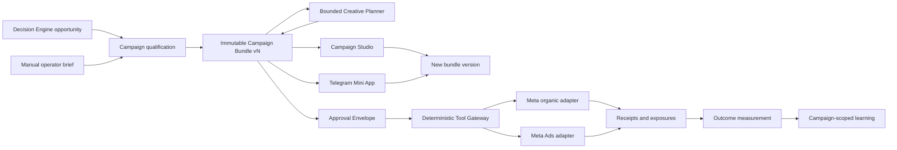

# Unified Campaign Bundle Design

## Status

The design decisions and written consolidation were approved in collaborative
review on 2026-08-11. Implementation planning is authorized. This document does
not claim that the described campaign, provider, or Decision Engine
capabilities already exist.

## Purpose

Turn the organization data, brand assets, channel connections, and business
context collected by AI Revenue OS into governed campaigns that can be planned,
created, reviewed, executed, and measured inside one closed loop.

The first production experience combines three mutually reinforcing jobs:

1. a manual creative studio for operator-directed image and copy generation;
2. governed organic social publishing; and
3. a bounded paid-media experiment with business-outcome measurement.

Telegram is used only for operator notification, review, revision, attestation,
and approval in this slice. Customer messaging through Telegram, WhatsApp, or
any other provider is deferred. The resulting experience should feel
autonomous after approval, but the autonomy remains constrained by an exact
proposal, deterministic policy, and explicit spend and channel limits.

## Product conclusion

This is both feasible and strategically useful if it is implemented as a
governed campaign system rather than as an unrestricted social-media agent.
The platform already collects inputs that can materially improve creative and
campaign relevance. Joining those inputs with the Decision Engine and the
measurement model can make the platform's reasoning visible and produce a
compelling end-to-end result.

The difficult work is not generating an image or caption. It is maintaining a
trustworthy contract between proposal, human approval, provider execution, and
business evidence. That contract is the center of this design.

## Current platform state and implementation gap

This proposal builds on useful foundations, but it is not an incremental UI
addition over an already-existing campaign runtime.

- Guided onboarding currently captures brand voice, languages, claims and
  approval restrictions, asset-source references, owned channels, public
  profiles, account ownership, and conversion-tracking status. It does not yet
  provide a canonical, versioned asset library or ingest the referenced brand
  files as governed creative inputs.
- The onboarding channel section explicitly records presence without collecting
  credentials. A declared channel must not be mistaken for a connected or
  executable provider capability.
- Integration Hub V1 currently rejects write-capable and webhook-capable
  provider definitions. Campaign publishing will extend the Integration Hub's
  provider and organization-capability model to represent governed actions and
  webhook intake with their exact scopes and restrictions. It will not create
  a parallel connection system or relabel an existing read integration as
  write-ready.
- Decision Engine V1 is specified as recommendation-only and the roadmap places
  the Tool Gateway, durable execution, outcome measurement, and controlled
  publishing after its data and economics prerequisites.
- No production Campaign Bundle, campaign route, write-capable Meta adapter,
  campaign webhook intake, Telegram Mini App identity link, or campaign
  execution workflow exists in the current application. Campaigns and
  Executions remain visible future navigation destinations.
- Postgres, Supabase Auth, and RLS are the authoritative control-plane boundary.
  Trigger.dev is an execution mechanism, not the source of truth for approval,
  spend, or provider state.

Consequently, the feature is feasible as a staged production vertical, but it
must not be estimated or implemented as a single generative UI task. The
delivery gates later in this document are prerequisites for one integrated
product experience, not evidence that any provider capability already exists.

## Design principles

- **One campaign brain, multiple governed executors.** A unified Campaign
  Bundle owns strategy and intent; channel adapters perform only validated
  actions.
- **Decisions remain separate from execution.** The Decision Engine may propose
  a campaign. It may not call a provider or move money. Every side effect goes
  through the deterministic Tool Gateway.
- **Approval is version-exact.** Approval covers an immutable proposal and its
  limits, not a mutable campaign name or an open-ended agent objective.
- **Prompting is a governed edit surface.** Operator prompts produce typed,
  reviewable revisions; they never bypass validation, policy, or approval.
- **Exploration is mandatory but bounded.** Every proposal includes a distinct
  experimental direction within the operator-selected generation profile. It
  may challenge soft brand conventions only when that profile permits it and
  always respects hard factual, legal, policy, and safety constraints.
- **Capabilities are organization-scoped.** A channel is executable only when
  that organization has the required connection, permissions, credentials,
  action grants, and provider readiness.
- **Business proof outranks activity volume.** Reach, clicks, and engagement are
  useful diagnostics. They are not automatically evidence of incremental gross
  profit or customer acquisition.
- **The platform core stays industry-neutral.** Industry Packs may contribute
  playbooks, vocabulary, economics, constraints, and evaluation rules without
  introducing industry-specific fields into core campaign records.

## Scope

### First production experience

The first production slice includes:

- two entry points: a Decision Engine opportunity and a manual operator brief;
- one immutable, versioned Campaign Bundle shared by every review and execution
  surface;
- generated static images and channel-specific image adaptations;
- control, evidence-led, and experimental creative directions;
- editable hooks, captions, channel-appropriate hashtags, internal content
  tags, calls to action, timing rationale, and schedule;
- Instagram and Facebook image posts and image Stories;
- one bounded Meta Ads experiment with a locked spend ceiling;
- Telegram-native operator notification and a Telegram Mini App for complete
  review, prompt revision, visual-truth attestation, and approval;
- provider-confirmed execution, reconciliation, and exposure records;
- a preregistered measurement plan and evidence-qualified business conclusion;
  and
- campaign-scoped learning with a separately approved path to reusable recipes.

Telegram does not deliver campaign content to customers in this slice. Its
connection is an operator-control capability and cannot be selected as a
campaign audience channel.

### Explicit non-goals

This slice does not include:

- video or Reels generation and editing;
- autonomous comments, direct messages, or community moderation;
- customer messaging through WhatsApp, Telegram, or another messaging
  provider;
- an unrestricted agent controlling an entire social account;
- automatic budget expansion, audience expansion, or channel substitution;
- paid-media providers beyond Meta;
- automatic promotion of campaign learning into permanent brand policy;
- cross-organization reuse of customer data, assets, prompts, or learned
  creative recipes;
- deletion of already-public content without a separately approved rollback
  action; or
- a business-impact claim without a baseline, attribution method, evidence
  quality, and measurement window.

## Entry points and qualification

### Decision Engine opportunity

The Decision Engine is the authoritative campaign strategist. Based on trusted
Business Memory, Digital Twin facts, connected-source observations, registered
metrics, industry-pack guidance, and deterministic economics, it proposes:

- the business objective and hypothesis;
- the intended audience and offer;
- the channel mix and reason for each channel;
- the spend envelope and stopping conditions;
- the schedule window and timing rationale;
- the measurement baseline, outcome metric, attribution method, and window;
- hard claims or assertions that creative must not contradict; and
- known uncertainty, missing data, and policy constraints.

Models may interpret and rank evidence, draft language, and propose treatments.
Deterministic services remain responsible for eligibility, policy, permissions,
economics, spend limits, and execution authorization.

### Compatibility with Decision Engine V1

Decision Engine V1 selects exactly one action per decision and excludes
multi-action plans and stochastic exploration. This design preserves that
contract: the selected action is one versioned campaign-playbook opportunity,
not a top-K selection of independent channel actions. After the opportunity is
created, Campaign Bundle compilation expands that single selected action into
the proposed creative and channel execution plan. The expansion remains inside
the opportunity's objective, assertions, economics, risk tier, and evaluation
plan.

The mandatory experimental creative direction is within-bundle treatment
exploration. It is not Decision Engine candidate exploration, does not change
candidate selection propensity, and does not let a model alter deterministic
ranking. Any later experiment that randomly assigns campaign treatments needs
an explicit experimental design and recorded assignment probability; it must
not be inferred from the existence of three creative directions.

Public organic publishing, broad outbound messaging, and paid-media execution
are Tier 3 actions under the current approval specification. Broad outbound
messaging is out of scope for this slice. Public organic publishing and
paid-media execution require human approval initially. Automatic execution
after approval is permitted only inside the approved Campaign Bundle envelope
and does not reduce their risk tier.

### Manual operator brief

The manual Studio entry creates the same type of Campaign Bundle and enters the
same qualification pipeline. It does not receive a weaker safety path.

The operator may provide an objective, audience, offer, dates, channels, spend
preference, and creative direction. The platform enriches the brief with known
organization context and clearly identifies missing evidence. It must not
invent an expected impact, baseline, audience permission, or economic case.
Required missing data moves the campaign to `needs_data`; it cannot be
approved or executed until resolved.

## System architecture

### Component responsibilities

**Decision Engine** proposes campaign strategy from qualified evidence. It does
not generate executable provider calls.

**Campaign qualification** validates completeness, capability availability,
economic plausibility, registered measurement, and hard policy constraints. It
produces blockers rather than fabricated defaults.

**Creative Planner** generates the creative treatments, images, copy, timing
ideas, and channel adaptations inside the strategy envelope. It cannot expand
spend, channels, audience, offer, factual claims, or measurement assertions.

**Campaign Studio** is the primary platform review and editing surface. It
presents the exact current version, validation status, blockers, revisions,
and approval consequences.

**Telegram review** sends an operator a media-rich summary in the connected
chat and opens a Telegram Mini App for the complete review workflow. The bot
message is a notification and entry point, not an alternate unvalidated
approval path.

**Approval service** records attestations and produces an immutable Approval
Envelope tied to the bundle digest.

**Tool Gateway** performs the atomic preflight, authorization, budget
reservation, idempotency enforcement, and policy checks before handing a
bounded action to a provider adapter.

**Provider adapters** translate already-authorized channel actions into
provider requests. They report provider state and receipts; they cannot alter
campaign intent.

**Measurement and learning** connect exposure evidence to registered business
outcomes and produce a qualified conclusion. Learning remains local to the
campaign unless separately promoted.

Trigger.dev is suitable for durable execution, retries, reconciliation, and
measurement windows. Postgres remains authoritative for campaign state,
approval, authorization, budget reservation, provider receipts, and audit.

## Campaign AI runtime

The Campaign Agent is a governed product role composed from bounded services
and tasks. It is not one long-lived model process and it does not receive
provider side-effect tools.

The selected first-slice runtime is:

- Trigger.dev `schemaTask` workflows for qualification, generation,
  regeneration, validation, scheduling, dispatch, reconciliation, measurement,
  and learning proposals;
- Vercel AI SDK generation calls inside the tasks for creative judgment and
  typed structured output, followed by application-level Zod validation and
  deterministic policy checks;
- Postgres records as the authoritative checkpoints between stages; and
- the Tool Gateway as the only path from an approved channel action to a Meta
  provider adapter.

Task inputs carry organization, campaign, bundle-version, and stage identities
rather than duplicating the whole mutable campaign document. Task-level
idempotency, organization-aware queues, bounded retries, cancellation fences,
and provider reconciliation complement—but never replace—the database
authorization and action ledger.

Trigger.dev `chat.agent` is not the primary campaign orchestrator because the
campaign lifecycle is a versioned workflow, not a conversation. If the Studio
later needs a durable multi-turn creative copilot, `chat.agent` may provide that
conversation shell. Its tools are limited to reading the current review
snapshot, proposing a typed patch, requesting regeneration, and explaining a
diff. The application service must validate and persist every accepted patch as
a new Campaign Bundle version. The Telegram Mini App uses the same revision
service or revision task rather than a separate agent state.

### Decision-cycle runtime amendment

Task 5 preflight on 2026-08-13 found two control-plane prerequisites that the
original release plan assumed but the implemented Decision ledger did not yet
provide: a retry-safe cycle claim and an executable reference for each
deterministic scoring artifact. The following design is part of the approved
Campaign runtime, not a separate optimization or execution system.

#### Database-authoritative cycle claims

Trigger.dev delivery idempotency complements the database boundary; it does not
replace it. A private, organization-scoped Decision-cycle operation ledger owns
the business idempotency key, normalized request digest, cycle ID, status,
claim token, lease expiry, attempt count, cancellation state, and bounded result
references. It contains no source payload, evidence bundle, credential, or
customer data.

The worker contract is:

1. Validate the `schemaTask` payload before constructing a service-role client.
   The payload carries an organization ID, correlation ID, bounded business
   idempotency key, and an enumerated trigger type; it never carries trusted
   tenant scope as free text.
2. Atomically claim or reclaim the operation through a security-definer RPC.
   The first claim creates the cycle. A matching completed request returns its
   stored result; an active duplicate reports `in_progress`; an expired lease
   may be reclaimed with a new token; reuse of a key with a different request
   digest fails closed.
3. Check the task cancellation signal and the live database claim before
   expensive reads and again before persistence. Renewal extends only the
   matching active token. Cancellation and lease takeover fence the old worker.
4. Persist the one-playbook Campaign decision and complete its cycle through a
   claim-aware RPC in one transaction. The RPC rechecks organization, request,
   token, lease, and cancellation state before writing the Decision aggregate
   and bounded completion result. Direct service-role execution of the
   unfenced cycle-start and aggregate-write RPCs is revoked.
5. Emit `decision.cycle_started` only for a newly acquired cycle. The existing
   Decision service emits the Task-4-owned result transition after persistence:
   `decision.recorded`, `decision.needs_data_identified`, or
   `opportunity.proposed`. Replayed completed operations do not emit a second
   transition. Event payloads remain identifier-only.

The first Campaign playbook produces at most one scored candidate, so its cycle
persists exactly one Decision aggregate. This amendment does not generalize the
worker into a multi-playbook scheduler or add an optimizer.

#### Versioned deterministic implementations

An artifact identifier is not enough if the code cannot determine which
behavior that version represents. Deterministic artifact versions therefore
carry a constrained implementation key resolved through an in-process registry.
The first registered keys identify the existing evidence-tier/value/time
ranking order and the first human-authored confidence calibration. Unknown keys
fail closed. No stored JSON, prompt, or model output is evaluated as policy.

The confidence implementation consumes only declared evidence tier,
completeness grade, input age relative to the playbook freshness bound, and the
sample size where an observed-history estimate is used. It returns a bounded
rule-derived value plus a rationale code. It does not invent impact. Ranking
continues to use evidence tier first, then expected contribution, then time to
impact, with the candidate fingerprint as the stable final key. Each record
pins the exact current artifact identifiers; persistence already rejects a
historical or unpromoted tuple.

Baseline implementation parameters are explicit and deliberately conservative:

- computed evidence starts at `0.75` for a complete economics grade and `0.55`
  for a partial grade;
- freshness applies no adjustment through half of the declared freshness
  window and subtracts `0.10` after that point; inputs beyond the bound are
  screened out rather than scored;
- observed evidence requires a declared comparable-intervention sample and is
  not enabled by the Campaign source until that source exists; and
- prior evidence requires a human-authored prior on the active playbook version
  and is not synthesized from missing economics.

These values live behind the versioned implementation key. Changing them means
creating and promoting a new artifact version; it is never an unrecorded code
constant change.

#### Honest Campaign evidence boundary

The production evidence loader reads only authoritative, organization-scoped
records: current organization profile and verified Business Memory facts,
brand constraints and asset readiness, active registered goal metrics, channel
economics, active policy, current playbook/artifact versions, Integration Hub
mapping and governed capability grants, tracking readiness, suppressions, and
active opportunity count. Missing or stale evidence is named and produces
`needs_data`; the loader does not manufacture a candidate-shaped default.

A selected Campaign action additionally requires a defensible impact range
with currency, source revision IDs, observation time, and either arithmetic
basis or comparable-intervention attribution. Contribution margin alone does
not establish campaign lift. Until such impact evidence and the required Meta
action grants exist, the live `campaign.meta_bundle_v1` path must record
`needs_data`. Selected-action tests use an explicitly labelled controlled
evidence fixture to prove the deterministic funnel and persistence contract;
fixture evidence is never available to the production loader.

The worker runs the existing pure boundaries in order: slot-budget calculation,
source generation, set-based screening, versioned confidence, expected
contribution, evidence-tier ranking, policy/margin/budget gates, and aggregate
persistence. A slot budget of zero records `no_action` without screening. A
missing active policy halts and releases the lease as a safe operational
failure; it never defaults to permissive.

#### Verification and rollback

Task 5 must prove payload validation precedes service-client construction;
matching replay, conflicting duplicate, active duplicate, expired-lease
takeover, stale-token fencing, and cancellation; `needs_data`, `no_action`, and
selected action; current-version resolution; cross-organization payload and
reference rejection; and identifier-only event publication. Database tests run
with representative service-role and API roles and show that no direct table
grant bypasses the claim-aware RPCs.

The migration is forward-only after use. Rollback disables new Task dispatch,
cancels or lets active claims expire, and leaves completed cycles and Decision
records intact for audit. The private operation ledger may be retired only
after its retention window; historical decisions and artifact versions are not
rewritten.

## Proposed logical records

These are conceptual boundaries for implementation planning, not claims about
the current schema or final table names.

- **Campaign**: stable organization-scoped identity, source entry point,
  objective, and lifecycle summary.
- **Campaign Bundle Version**: immutable normalized proposal document, content
  digest, provenance, validation results, and relationship to its parent
  version.
- **Creative Asset**: generated or supplied asset, source, transformation
  lineage, classification, content hash, storage reference, and truth status.
- **Creative Direction**: control, evidence-led, or experimental treatment with
  rationale and linked assets/copy.
- **Channel Action**: desired provider-independent action, schedule,
  prerequisites, payload digest, execution mode, and current action state.
- **Approval Envelope**: exact version digest, approver, approval time, expiry,
  channels, audience, schedule window, spend ceiling, capability assumptions,
  assertions, and attestations.
- **Execution Authorization**: short-lived, idempotent claim produced by the
  Tool Gateway after successful preflight and budget reservation.
- **Provider Receipt**: external reference, request identity, provider state,
  timestamps, and sanitized reconciliation evidence.
- **Exposure Record**: evidence that a person or aggregate audience could have
  received the campaign action, with source and confidence.
- **Measurement Plan and Outcome**: baseline, metric definition, attribution
  method, window, result, evidence quality, and conclusion.
- **Learning Proposal**: campaign-local observation or a separately reviewable
  proposal to create or update a reusable brand recipe.

Every record that can affect or reveal organization state is organization
scoped. Cross-record relationships must preserve that scope at both database
and application boundaries.

## Creative generation and controlled exploration

Before generation, the operator selects a bundle-level generation profile and
may override it for an individual creative direction:

- **Brand restricted** preserves both hard rules and the active brand's soft
  visual system, including approved palette, typography, logo treatment,
  composition rules, and tone boundaries.
- **Brand guided** is the default. It preserves hard constraints and core brand
  identity while permitting an explicitly disclosed stretch of soft
  conventions in the experimental direction.
- **Full visual generative freedom** preserves hard factual, legal, policy,
  intellectual-property, offer, and safety constraints but does not require
  adherence to soft visual conventions.

The selected profile is stored on the bundle version and each generated asset,
shown in Studio and Telegram review, and included in the approval digest.
Changing the profile or a direction override creates a new bundle version and
invalidates prior approval. Full visual freedom never relaxes visual-truth
attestation or permits an unsupported real-world representation.

The Creative Planner also proposes a channel-specific hashtag set with a short
rationale. Hashtags remain directly editable and are distinct from internal
content tags. Deterministic validation enforces provider count and character
limits, removes duplicates, checks organization restrictions and prohibited or
misleading terms, and preserves operator-authored changes. Hashtags are a
discoverability treatment to test, not a guaranteed reach claim.

Every reviewable proposal contains exactly one clearly labelled control
direction and at least one evidence-led variant and one experimental direction.
The experimental direction is not decorative variation. It must articulate:

- the assumption it challenges;
- how it differs from the control;
- why the difference could improve the registered outcome;
- which soft brand convention it stretches, or which other treatment
  hypothesis it explores when the profile is Brand restricted; and
- which evidence will determine whether the direction was useful.

Hard constraints include factual accuracy, required disclaimers, legal and
provider policy, intellectual-property rules, protected-class restrictions,
privacy and audience restrictions, organization prohibitions, and the approved
offer. Soft conventions—such as familiar composition, tone intensity, or
palette emphasis—may be challenged only under a profile that permits it and
must be disclosed in review.

Generated assets retain generation provenance and a synthetic-content
classification. Assets must never be presented as verified photographs of a
real location, employee, customer, product state, event, endorsement, or result
unless the underlying evidence supports that representation.

## Campaign Bundle contract

A reviewable Campaign Bundle is a complete proposal, not a loose folder of
assets. It contains:

- strategy, objective, hypothesis, audience, offer, and evidence;
- control, evidence-led, and experimental directions;
- images, channel adaptations, copy, hooks, channel-appropriate hashtags,
  internal content tags, calls to action, generation profiles, and asset
  provenance;
- organic post and Story schedule with timing rationale;
- paid experiment structure, audience, placements, creative mapping, budget,
  schedule, and stopping conditions;
- channel capability status and blockers;
- policy results, assertions, risks, and uncertainty;
- measurement baseline, tracking requirements, outcome definition,
  attribution method, and window; and
- execution mode: `best_effort` or `all_channels_required`.

`best_effort` permits ready actions to execute when an optional channel is
blocked. `all_channels_required` blocks the entire bundle unless every required
channel is ready. The UI must make this distinction explicit before approval.

## Prompt editing and versioning

Operators can edit directly or submit a natural-language instruction scoped to
the whole bundle, one direction, channel, asset, caption, hashtag set,
generation profile, or schedule. A model turns a prompt into a typed patch
against the current version. The server then:

1. validates the patch schema and target version;
2. rejects changes outside the requested scope or operator permissions;
3. reruns factual assertions, policy, capability, economics, tracking, and
   readiness checks affected by the change;
4. generates a new immutable Campaign Bundle version;
5. computes and presents a human-readable and machine-readable diff; and
6. invalidates any approval that covered an earlier version.

Models do not write bundle state directly. A prompt that attempts to bypass an
approval, conceal synthetic content, change spend outside policy, or weaken a
hard constraint is rejected with a safe explanation.

Material changes always create a new version. This includes creative or copy,
factual claims, destination, audience, schedule, channel, budget, offer,
measurement, generation profile, and execution mode. Approved versions are
never mutated in place.

## Studio and Telegram review contract

### Campaign Studio

The Studio presents the campaign in review order:

1. overview, objective, source, readiness, and expected evidence;
2. strategy and Decision Engine rationale;
3. creative directions and visual-truth status;
4. organic schedule and channel previews;
5. Meta ad experiment, audience, placements, and spend;
6. measurement, baseline, attribution, and outcome window;
7. policy, capability, assertions, blockers, and warnings; and
8. version history, prompt revisions, and diffs.

The creative section exposes the bundle-level generation-profile selector and
per-direction overrides. Hashtags have direct-edit controls as well as scoped
prompt revision. Both changes create a new bundle version and appear in the
review diff.

Every preview identifies its channel and format. Any unavailable capability is
shown as blocked, not simulated. The operator can approve only when mandatory
readiness requirements and attestations are complete.

### Telegram-native review

The connected bot sends the operator a concise proposal summary and image
assets, then opens a Telegram Mini App for the full review. The Mini App must:

- validate Telegram-signed initialization data server-side;
- map the Telegram identity to a previously linked platform identity;
- recheck live organization membership, role, and campaign permission on every
  sensitive mutation;
- display the organization, exact bundle version and digest, media, channels,
  generation profiles, captions, hashtags, blocked channels, spend ceiling,
  schedule, audience summary, and expiry;
- support scoped prompt revisions and show the resulting version diff;
- collect the mandatory visual-truth attestation; and
- approve only the exact version currently displayed.

A linked identity is not permanent authorization. Role removal, organization
removal, disabled Telegram review capability, or an expired review session must
immediately prevent revision and approval.

## Approval Envelope

Approval records the operator's informed consent for an exact execution
envelope. It locks:

- bundle version and normalized digest;
- approving user and organization;
- approval timestamp and expiry;
- selected channels and required/optional status;
- audience and targeting boundaries;
- schedule window and organization timezone;
- paid spend ceiling, currency, and any action-level limits;
- provider capability assumptions;
- factual assertions and policy evaluation references;
- tracking and measurement prerequisites;
- synthetic-content classification; and
- the operator's visual-truth attestation.

The attestation confirms that the operator reviewed all proposed visual assets
and that they do not falsely depict or imply verified real-world facts. It does
not transfer responsibility for provider policy, factual validation, or other
deterministic checks to the operator.

After approval, the agent may schedule, publish, and spend automatically only
inside this envelope. Any material change creates a new version and requires a
new attestation and approval.

## Integration Hub capability gating

Campaign publishing integrations extend the existing Integration Hub. The Hub
remains the organization-facing inventory of connections, capabilities,
restrictions, credential health, and provider readiness for both data ingestion
and governed actions.

A provider definition must describe more than a coarse `supportsWrites` or
`supportsWebhooks` flag. It declares:

- its integration character: data source, action destination, bidirectional
  provider, or operator-control surface;
- its registered read, publish, advertise, metrics, webhook-intake, and
  operator-review capabilities;
- required account types, authorization scopes, assets, and provider
  prerequisites for each capability;
- content formats, placements, rate limits, geographic or account restrictions,
  and unsupported operations; and
- the versioned adapter and policy class allowed to implement each action.

An organization's connection stores the evaluated state of those declared
capabilities. Each state distinguishes configured, verified-ready, temporarily
blocked, revoked, unsupported, and disabled, with a safe reason and last-check
time. Registering a provider capability does not grant it to an organization.

Integration Hub V1's blanket rejection of write and webhook definitions is
replaced only for bounded capabilities backed by an installed adapter and
organization authorization. An outbound action capability additionally
requires deterministic policy and a Tool Gateway route. An inbound webhook
capability instead requires signature verification, replay protection,
organization mapping, and an allowlisted event contract. No user-facing
request path calls a write adapter directly.

Campaign readiness is evaluated per organization and per channel action. A
visible connection record alone is insufficient. It includes:

- supported provider and account type;
- valid authorization and current scopes;
- credential health and revocation state;
- provider-specific publishing or advertising eligibility;
- correct asset, content format, and placement;
- required tracking and destination validity; and
- current policy and feature entitlement.

Meta organic publishing, Meta Ads management, Meta webhook intake, and Telegram
operator review are separate capabilities. Telegram operator review cannot be
selected as a customer campaign channel. There is no silent fallback from one
provider, account, placement, or channel to another.

Provider behavior and permissions change. Implementation must verify the live,
official provider contract and scopes for each capability rather than treating
this design document as an API reference.

## Execution safety

### Atomic preflight

Before any provider call, the Tool Gateway performs a deterministic preflight
inside a transactional authorization boundary. It checks:

- organization, actor, bundle digest, and action ownership;
- valid, unexpired approval for the exact version;
- current policy and assertion results;
- schedule window and cancellation state;
- action idempotency and prior provider outcomes;
- budget availability and reservation for paid actions;
- current channel capability and credential health;
- asset, destination, and tracking readiness; and
- applicable guardrails and stopping conditions.

Success locks the necessary records, reserves bounded spend, and returns a
short-lived execution claim for one action. Failure returns a safe blocker and
makes no provider call. The model never receives provider credentials or an
unbounded execution tool.

### Action lifecycle

Each channel action progresses independently:

`queued -> claimed -> requested -> provider_pending -> confirmed -> reconciled -> measured`

Terminal or intervention states include `failed`, `blocked`, `cancelled`, and
`provider_outcome_unknown`. A timeout after a request may not be retried as if
nothing happened. The adapter must first reconcile by idempotency identity or
provider reference to prevent duplicate posts, ads, or spend.

Retries are allowed only for classified transient failures and only inside the
approved schedule and spend envelope. Cancellation fences stale workers and
future claims. Revoked credentials disable the affected capability. A
guardrail breach pauses controllable future actions while preserving truthful
records of actions that already happened.

### Partial success

There is no false rollback of a post or ad that a provider has already
accepted. In `best_effort` mode, unaffected ready actions may continue
unless policy or a campaign guardrail requires a pause. In
`all_channels_required` mode, preflight blocks dispatch unless the complete
required set is ready. Once execution has begun, all observed partial outcomes
remain visible and auditable.

Deleting or retracting public content is a new side effect and requires a
separately authorized rollback action. It is not an automatic error handler.

## Campaign lifecycle

The campaign lifecycle is:

`initiated -> qualifying -> generating -> draft_vN -> ready_for_review -> attested -> approved_vN -> scheduled -> active -> measuring -> concluded`

Important branches are:

- `needs_data` when required strategy, evidence, capability, or measurement
  inputs are missing;
- `revising` when direct or prompted edits are being validated into a new
  version;
- `blocked` when current deterministic policy or readiness prevents execution;
- `paused` when a guardrail, operator action, or capability loss stops future
  work; and
- `cancelled` when future execution is fenced while historical results remain.

An approved version is not mutable. Revision produces `draft_vN+1`; the prior
version and approval remain historical evidence but cannot authorize the new
version.

Campaign state summarizes the bundle. Action state remains independent, so one
provider failure cannot erase or misrepresent other actions.

## Closed-loop business proof

Every executable bundle preregisters:

- a registered primary business metric;
- the baseline source and lookback period;
- the audience or unit of analysis;
- exposure and tracking requirements;
- attribution or experimental method;
- outcome window and reporting delay;
- minimum evidence quality;
- economic inputs needed to estimate incremental gross profit;
- guardrails and stopping conditions; and
- the fallback conclusion when evidence is insufficient.

The measurement pipeline links the approved proposal to execution receipts,
exposure evidence, observed outcomes, and current metric definitions. It emits
one of four honest conclusions:

- **validated outcome**: the preregistered evidence standard was met;
- **inconclusive**: execution occurred, but evidence cannot support the causal
  or incremental claim;
- **guardrail breach**: a cost, quality, privacy, or business guardrail failed;
  or
- **execution-only**: provider activity is verified, but no qualified business
  outcome is available.

Contribution, tracked purchases, qualified inquiries, or consented redemptions
may serve as business outcomes when they are registered and attributable.
Impressions, reach, reactions, engagement, and clicks remain diagnostic unless
the campaign's approved measurement design gives them a separate valid role.

The system must show baseline, method, window, evidence quality, uncertainty,
and economic assumptions next to every conclusion. It must not label a
correlation as incremental impact.

## Campaign-scoped learning

Creative and execution observations are initially scoped to the campaign. They
may inform later variants inside that campaign while remaining within the
approved envelope.

At conclusion, the system may propose a reusable recipe such as a creative
pattern, timing hypothesis, copy structure, or soft brand convention. That
proposal includes supporting and contradicting evidence, affected segments and
channels, known limitations, and an expiry or review date. It requires separate
operator approval before entering Business Memory or influencing other
campaigns.

Hard policy, factual truth, privacy requirements, and provider restrictions are
never weakened by learned creative performance.

## Tenancy, authorization, and data protection

- All campaign, asset, approval, capability, execution, receipt, exposure,
  measurement, and learning records are organization scoped and protected by
  RLS.
- Organization identifiers supplied by a request are validated against the
  authenticated route context and any referenced record.
- User-facing request paths use the caller's session and do not bypass RLS with
  a service role.
- Privileged security-definer mutations validate organization membership,
  permissions, inputs, and referenced-record ownership inside the database
  boundary.
- Approvals, attestations, execution authorizations, and sensitive changes emit
  stable audit events.
- Provider tokens, raw audience exports, provider payloads containing
  unnecessary PII, and raw signed Telegram initialization data are not written
  to logs.
- Stored assets use private organization-scoped access and controlled signed
  delivery where provider upload requires it.
- Tracking-consent, privacy, and audience-eligibility changes take precedence
  over an older campaign approval at execution time.
- Retrieval and generation context is minimized to the campaign need and must
  not cross organization boundaries.

## AI boundaries and evaluation

Every model boundary uses a versioned Zod schema and records model/provider,
prompt or policy version, source references, token/cost metadata, latency,
output digest, and evaluation result without logging sensitive raw context.

The AI may:

- interpret qualified business context;
- draft and adapt creative;
- propose experimental directions;
- explain timing and channel rationale;
- translate a scoped operator prompt into a typed patch; and
- summarize measured evidence with uncertainty.

The AI may not:

- determine authorization, channel capability, privacy compliance, policy
  compliance, budget availability, or final eligibility;
- create an unregistered fact, metric, baseline, or business-impact claim;
- call provider APIs or money-moving tools;
- mutate an approved proposal; or
- conceal blocked actions, synthetic provenance, uncertainty, or partial
  failure.

Evaluation suites must cover malformed output, unsupported claims, conflicting
Digital Twin or Business Memory facts, prompt injection embedded in source
content or operator instructions, cross-tenant retrieval, synthetic-content
misrepresentation, prohibited targeting, policy evasion, excessive tool or
generation loops, and experimental directions that are not meaningfully
distinct.

## Failure handling and observability

Failures are typed as validation, authorization, policy, capability, privacy,
budget, provider-transient, provider-terminal, provider-unknown, measurement,
or internal errors. Public errors remain safe and actionable. Uncertain
provider or business states are never reported as success.

Telemetry is emitted per campaign version and channel action using
`organizationId`, `campaignId`, `runId`, `workerId`, and `correlationId` where
available. Operational views should expose:

- time spent in qualification, generation, review, approval, and execution;
- action success, retry, reconciliation, block, and unknown-outcome rates;
- provider latency and rate-limit pressure;
- approval invalidation and expiry;
- reserved, requested, confirmed, and reconciled spend;
- capability, policy, privacy, and tracking blockers;
- measurement readiness, evidence delay, and conclusion quality; and
- model generation cost and evaluation failures.

Alerts should prioritize stuck provider-unknown actions, budget inconsistencies,
cross-tenant authorization failures, invalid webhook signatures, privacy
violations, repeated adapter failures, and guardrail breaches.

## Delivery sequence

The feature is one production experience but activates through internal safety
gates:

1. Campaign Bundle domain, immutable versioning, approval envelope, audit, RLS,
   and policy boundaries.
2. Creative generation port, asset provenance, controlled exploration, Studio,
   prompt revisions, and visual-truth attestation.
3. Telegram Mini App identity and review flow plus deterministic dry-run
   provider adapters.
4. Real Meta organic publishing through a controlled test account and provider
   reconciliation.
5. One capped Meta Ads experiment with transactional budget reservation and
   stopping conditions.
6. Outcome-window processing, evidence-qualified conclusion, and learning
   proposal.

These gates are implementation and rollout controls, not separate disconnected
products. The product surfaces one bundle and truthfully shows which approved
actions are ready, blocked, active, or measured.

The first reference campaign may use a Restaurant Industry Pack playbook, but
the campaign, approval, execution, and measurement core remains
industry-neutral.

## Verification strategy

### Domain and database

- bundle normalization, digest stability, diffs, and immutable version chains;
- material edit approval invalidation;
- mandatory control, evidence-led, and experimental directions;
- mandatory visual-truth attestation;
- tenant isolation, composite organization ownership, and RLS;
- append-only approval, attestation, execution, receipt, and audit evidence;
- direct RPC misuse and organization/body mismatch;
- concurrent budget reservation and spend-ceiling enforcement;
- idempotent action claims, cancellation fences, and stale workers; and
- authorization-scope, capability, tracking-readiness, privacy, and policy
  changes after approval.

### AI and generation

- typed output and typed prompt-patch validation;
- hallucinated facts, metrics, baselines, offers, or permissions;
- source-content and operator prompt injection;
- synthetic-content truth classification;
- generation-profile switching and approval invalidation;
- hashtag relevance, platform limits, duplicate removal, and restricted-term
  handling;
- hard-constraint adherence and meaningful experimental novelty;
- cross-organization context leakage; and
- bounded cost, latency, retries, and generation loops.

### Adapter contracts and workflows

- live authorization scopes and account eligibility;
- idempotent create semantics and provider reference capture;
- provider rate limits, terminal errors, timeouts, and unknown outcomes;
- webhook signature, replay, organization mapping, and ordering;
- reconciliation before retry after an ambiguous send;
- partial success in both execution modes;
- credential revocation, capability loss, approval expiry, and policy change;
- cancellation during queued, claimed, requested, and provider-pending states;
  and
- provider spend reconciliation against platform reservations.

### End-to-end acceptance

The reference production test must demonstrate:

1. a qualified Decision Engine opportunity and a manual brief both enter the
   shared pipeline;
2. the bundle contains complete control, evidence-led, and experimental
   directions plus editable channel-appropriate hashtags;
3. an operator switches generation profile, uses a prompt to create a new
   version, and reviews the diff;
4. the Telegram Mini App rejects an invalid, expired, unlinked, or revoked
   identity and permits a currently authorized operator;
5. visual-truth attestation and exact-version approval are recorded;
6. a later material edit cannot reuse the old approval;
7. approved Meta organic content is actually published and reconciled;
8. the capped Meta Ads experiment cannot exceed its approved spend envelope;
9. an unavailable optional Meta placement remains truthfully blocked while
   ready actions may execute only in `best_effort` mode;
10. provider receipts and exposures feed the approved outcome window; and
11. the final conclusion states validated, inconclusive, guardrail breach, or
    execution-only with its evidence and uncertainty.

No critical or high-severity tenant, authorization, privacy, money-movement,
provider-duplication, or truthfulness issue may remain at production enablement.

## Alternative approaches considered

### Studio-led scheduler

A creative studio with direct per-channel scheduling would reach an attractive
demo quickly, but it would fragment strategy, approval, spend, and measurement
across assets. It remains useful as an interface, not as the system of record.

### Independent channel agents

Separate agents for Instagram organic, Facebook organic, and Meta Ads could
optimize locally, but they would create conflicting objectives, duplicated
budgets, inconsistent approvals, and difficult attribution. Channel-specific
reasoning is better implemented as bounded planners and adapters under one
bundle. Telegram remains a review surface, not a campaign executor.

### Asset-generation-only module

A generator that exports images and captions is lower risk and may be a useful
fallback if provider rollout is delayed. It does not deliver the desired
closed-loop business proof and therefore is not the selected product boundary.

## Durable decisions requiring ADR coverage

Implementation should add or update ADRs for:

- the Campaign Bundle as the cross-channel system of record;
- the Integration Hub's action-capability and restriction model for publishing
  providers;
- Trigger.dev tasks with Vercel AI SDK generation as the primary Campaign Agent
  runtime boundary;
- immutable version-exact approval and material-edit invalidation;
- deterministic Tool Gateway authorization and provider-outcome reconciliation;
- Telegram Mini App identity linking and live authorization checks;
- campaign-scoped learning with separately governed promotion; and
- registered business-outcome measurement as the campaign success contract.

## Implementation planning gate

Implementation planning may begin only after this written specification is
reviewed and approved. The plan must decompose the delivery sequence into
small, production-complete tasks with test-first acceptance, migration safety,
tenant-isolation verification, provider sandbox evidence, and explicit review
checkpoints. It must not collapse the design into a single god agent or a broad
unverified feature build.
