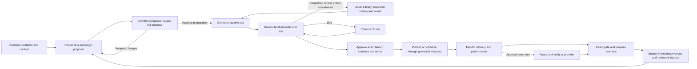

# Campaign experience and marketing loop — product design

**Status: design prepared for review; discovery decisions confirmed.** This document records the user's confirmed decisions and a reviewable design recommendation. It does not approve implementation, change current ADRs, authorize external actions, or claim a complete live workflow. Read the [audit](../../verification/campaigns/2026-09-12-workflow-audit.md) first.

## 1. Product purpose

Campaign is the business's marketing agent. It should recognize a real business shortcoming, research an appropriate response, explain a campaign proposal, obtain approval, prepare relevant creative, support revision, launch approved work, monitor it and carry evidence into the next cycle.

The experience should make six questions easy to answer: why this campaign, what will it do, what needs my decision, what is live, how is it doing, and what should we try next?

Shared business understanding comes from source-owned data and Business Memory. Memory supplies context and attributed lessons; it does not own prices, policy, budgets, permissions, measured outcomes or factual truth. This remains a coordinated set of bounded services behind one marketing-agent experience, as required by ADRs 0015/0017/0054.

## 2. Decisions already supplied by the user

- Growth Intelligence approval covers the audience, offer, channels, budget and success measures.
- Restore the prototype's separate Campaign-ready opportunities section under Recommendations and campaign preparation in Your actions.
- The agent may pause an underperforming ad within approved limits, retaining its evidence. A human decides on restart or removal.
- Creative Studio should be focused: campaign text, images, layouts, live preview and local AI edits.
- Every finished post/ad, including later variations, requires human review before publication. Creative-family approval cannot authorize unseen outputs.
- Research starts automatically from meaningful new business evidence and a configured schedule, with a manual Request a campaign action too. Frequency, cost and duplicate-proposal controls are visible settings.
- Present proposals supported by business evidence even when profit cannot yet be estimated or external market research is unavailable. Explain those gaps; publication and spending retain their approval and execution checks.
- Campaign portfolio, detail, Studio and Asset Library are all in scope; existing Growth Intelligence, Channels and Overview are inspiration, not compulsory page templates.

## 3. Decision register and scope

- **D05, confirmed:** every finished variation is reviewed before publication. Amend ADR 0020/Spec 016 and existing policy/UI wording accordingly; a generation cap only authorizes preparation, never unseen publication.
- **D06, confirmed:** campaign research runs from an organization-configured cadence and meaningful new business evidence, with a manual Request a campaign action; not on every page view, memory write or refresh. Cadence, provider cost allowance, maximum pending proposals and cooldown require explicit configuration. The plan does not invent numeric operating limits. The user's approval settles the product behavior; it does not activate a schedule or authorize a specific research spend now.
- **D07, confirmed:** allow useful source-backed campaign proposals without a numeric profit estimate or available external market research, including an unavailable market-monitoring profile. Show unknowns and scoped evidence honestly. Current governed-draft admission requires more; implementation must express this confirmed change in the new Campaign proposal contract and the formal spec/ADR amendment. Generic Decision execution admission and launch requirements remain strict.
- The initial execution contract is Instagram/Facebook static feed/story creative and Meta paid ads, matching the user's examples and existing boundaries. Video, Reels, additional ad networks, DMs and a full design canvas are separate expansions.

## 4. Approaches considered

- **Recommended — one campaign journey with purpose-specific workspaces.** Growth Intelligence owns discovery and proposal decisions; Campaign detail owns delivery and results; Studio owns focused editing; Asset Library owns reusable creative history. A persistent campaign identity and versioned contracts connect them. This keeps the business reason and execution state readable while allowing artwork to dominate the appropriate pages.
- **Calendar-first campaign suite.** Strong for scheduling many posts; less effective as the primary experience for deciding which business problem deserves a campaign. Use a calendar as a view of the approved schedule, not as the product's main organizing model.
- **Chat-first marketing agent.** Useful for clarifying a proposal or requesting a revision, but important choices, budgets and output comparisons would be difficult to scan and revisit if hidden in conversation. Keep optional contextual instructions inside the structured workflow; do not replace records with chat history.

## 5. The proposed journey

The second review and launch authorization can share one clear confirmation surface; the diagram does not require a third approval ceremony. It must show exactly what that confirmation permits. A future variation cannot inherit publication approval; it requires review of its own finished output.

### Step 1: identify an addressable business problem

- Use current source revisions, declared reporting windows, branch/channel scope, goals, constraints, prior actions and verified brand/subject facts.
- Distinguish a demand problem from supply, fulfillment, pricing or capacity constraints. Do not propose advertising as the automatic answer to every revenue decline. If the cause is operational, recommend the repair and state whether marketing should wait.
- Research audience needs, timing, offer plausibility and relevant market examples through the existing qualified research layer. Record sources, dates, geography and reuse rights. Internal private context must not enter a public query.
- Build a small set of alternatives, explain the recommended hypothesis, identify an alternative rejected on evidence, and record uncertainty. Provider ad libraries may show creative examples; visibility or longevity alone does not prove sales or profitability.
- Deduplicate by organization, business issue, audience, offer and evidence revision. Revisit a declined idea only when new evidence or its saved revisit condition warrants it. A helpfulness vote is not organization policy.
- A scheduled sweep evaluates whether fresh evidence warrants research; a due schedule alone does not require a new proposal. Explain no warranted proposal, skipped duplicate, research paused, exhausted allowance and failed research separately. Changing or pausing research settings does not cancel already approved campaigns or their performance/stop monitoring.

### Step 2: a complete proposal in Growth Intelligence

- Lead with an action title and the business problem. Include exact evidence period and scope.
- Show audience, offer/product, organic versus paid channels/placements, proposed timing, creative deliverable count, media budget, generation cost limit, success measures and stop conditions.
- Budget suggestions remain proposals until approved; media spend and platform generation cost are distinct amounts/currencies. Do not silently convert currency or fill missing cost with zero.
- Show estimated impact only with its inputs, assumptions, range, method and time horizon. If unestimated, explain why and still expose supported advice under confirmed D07. Missing external research cannot support external claims: keep internal observations, test hypotheses and unavailable market evidence visibly distinct.
- Show what the agent used from Business Memory and Creative History as provenance, not as extra market citations or authority to alter facts.
- Primary action **Approve & prepare creatives**; secondary **Request changes**; overflow **Snooze** / **Dismiss**, with saved reasons. These are proposed new business actions, not renames of Planned or Create governed draft.
- Approval binds exact proposal revision/digest and preparatory limits. New evidence that materially changes offer, audience, channels, budget or success plan requires a proposal revision and approval.
- Once approved, the same card shows preparation state and links to its real campaign. Your actions shows the saved decision, last update and retry/recovery where allowed. No duplicate approval state in Growth Intelligence.

### Step 3: generate a coherent creative set

- Create an explicit deliverable plan: direction, format, language, channel/placement, exact approved offer and destination. Every requested deliverable has a state; failed members cannot disappear from the set.
- Use subject grounding to depict the actual product/service; respect the explicit synthetic-asset setting. Use human-approved history for continuity and human-rejected history only through Blueprint analysis, under ADR 0049.
- Pin selected source versions and context before model spending. Store selection explanations, exclusions, conflicts, relevant negative rules and provider usage receipts.
- Generate textless visual plates, then compose exact text and brand marks. Multiple creative hypotheses should differ in a declared way useful for later comparison. A random image batch does not constitute an experiment.
- Completion means validated artifacts and saved lineage, not merely a completed Trigger run. Report partial failure, retry only affected bounded work and preserve good outputs.

### Step 4: review and revise actual deliverables

- Present large finished creative previews with actual caption, CTA, destination, schedule, paid/organic identity and language. A plate and a finished poster have visibly different labels.
- Allow per-output feedback, reasons, replacement and batch review with a selection summary. Selection alone does not approve.
- Open Studio with exact campaign version, deliverable, direction and language. Keep review context and return destination across navigation.
- Typed changes update an unsaved preview without authorizing publication. Saving creates the necessary immutable revision; final rendering is the authoritative artifact. Any output/content change invalidates affected launch approval.
- **Approve as a future design reference** is a separate library decision. A brand-approved design may have weak performance; a profitable ad may be unsuitable as a brand reference.

### Step 5: launch only what was reviewed

- Confirmation shows selected final creative thumbnails, copy, channel/account, placement, timezone, schedule, budget ceiling, expiry, measurement and pause terms.
- One approved launch set maps each action to exact final bytes and content hash. Never select the latest image or first direction asset at execution time.
- Revalidate permissions, account mapping, credentials, contract, tracking and spend at dispatch; saving approval does not freeze external availability.
- Represent per-action queued, scheduled, submitting, live, blocked, failed and confirmation-pending outcomes. Partial multi-channel delivery is visible; do not blanket-retry successful posts.
- A timeout after sending triggers reconciliation. Record a live link only when a provider receipt confirms the object. The platform may offer manual export, but must label it exported and cannot claim external publication without evidence.

### Step 6: monitor, contain and investigate

- Show delivery coverage, actual spend, reach/impressions, clicks and tracked conversions only where available. Define each metric, provider delay and observation window. Deduplicate reach only when the source supports it; do not add overlapping reach across platforms.
- Keep observed performance and causal business impact separate. A before/after increase does not by itself establish the campaign caused it; registered outcomes retain method, baseline, window and limitations.
- Display a comparable creative table and two-to-four selected previews side by side. Compare equivalent audience, objective, placement, delivery age, exposure and conversion lag; identify confounders before assigning an explanation.
- An approved deterministic stop rule can request a pause after its required exposure and reporting delay. Show the observation and threshold. Claim Paused only after provider read-back. Pending/unknown pause gets urgent attention because spending may continue.
- Clinical investigation reports: what happened; comparison group; plausible explanations; evidence for/against each; what cannot be known; next test; human feedback; and whether the lesson is campaign-only or approved for reuse.
- AI can propose a creative hypothesis or next-test variation. Deterministic services choose neither business facts nor causal conclusions from model confidence. Follow-up campaigns return to full proposal approval.

## 6. Workflow state and authority

- Do not add a single overloaded enum mixing research, generation, review, execution and learning. Retain Campaign lifecycle; add typed phase read models over independently persisted proposal, generation, deliverable review, launch action, measurement and investigation state.
- A campaign can have an active approved launch while a new proposal/version is being drafted. Editing must not erase historical live objects or imply they have stopped.
- UI stages are derived: **Proposal**, **Creating**, **Review**, **Scheduled / Live**, **Results & learning**, with an independent Needs attention marker and a concrete next action. Stage names are proposed display vocabulary, not values to insert into existing SQL enums.
- Retry creates a recorded attempt under the owning lifecycle and a stable user action key. Use bounded retries, cancellation, lease fencing, domain results and actual measured usage.
- Permissions use existing named capabilities; define new capabilities only where needed for a new action. Viewers read history; manage permission is not automatically launch/spend approval permission. Recheck roles after session changes and at background execution.

## 7. Scope and implementation boundaries

- Reuse Campaign identity/version/digest, Tool Gateway, measurement ledgers, domain types, compositor, private asset intake, Creative History core and Business Memory contracts.
- Add proposal approval and reviewed deliverable identity as explicit persisted contracts. A proposed architecture amendment must reconcile ADRs 0015/0017/0020/0049/0054 and Specs 005/010/016/019/020/022/023 before corresponding code is authorized.
- Preserve the global shell and industry-neutral core. Replace hardcoded Dishes with Products & Subjects; industry pack terminology may be displayed through an existing verified pack contract.
- Keep Channels and its Channel Audit page outside redesign implementation. Growth Intelligence changes are limited to campaign proposal/preparation surfaces and their owning read contracts. Overview only needs compatible existing campaign/asset previews and destinations.
- Do not ship an attractive Launch button ahead of exact render binding, adapter registration, confirmed stop capability and truthful status reconciliation.

## 8. Success criteria

- A client can review a meaningful campaign proposal derived from actual business evidence without writing the strategy themselves.
- The client can upload a past design, review it, and inspect whether and why a subsequent campaign selected it.
- Rejected image bytes cannot reach the final image adapter.
- The client can correct text or a marked image area, inspect the result and approve the exact deliverable that is later sent.
- The failed-run reproduction becomes an actionable saved outcome with a valid recovery path.
- An approved output launches once, receives a provider identity, collects delayed results and can be demonstrably paused.
- A clinical comparison produces evidence-linked hypotheses and a next test, with no invented attribution or automatic brand-rule promotion.
- Portfolio, detail, Studio and Library remain usable under no-data, partial failure, stale data, expired approval, mobile, keyboard, viewer and cross-tenant denial scenarios.

Measure operational success separately from business success: time from proposal to decision, failed/orphaned work, first-pass creative acceptance, uploaded-to-usable conversion, reviewed/published artifact agreement, metric freshness, verified pause latency and lesson provenance coverage. Any business-lift claim requires its registered measurement proof.
